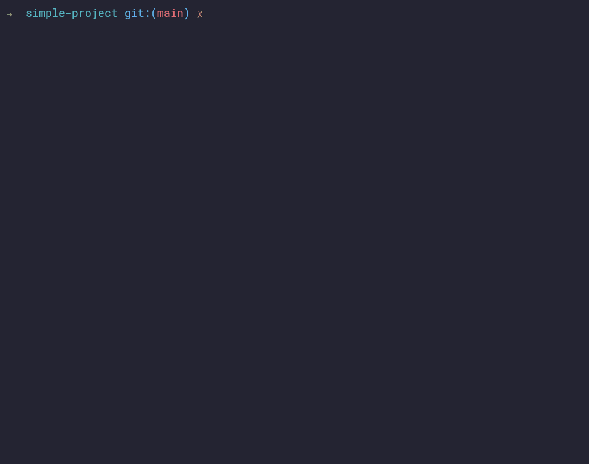

<div align="center">

<h1>doxhell</h1>

[]()
[](
  https://github.com/psf/black)
[](/LICENSE)
[](
  https://github.com/sisalik/doxhell/actions/workflows/ci.yml)

</div>

## About

> :warning: **Work in progress**: There is still plenty of development and testing to do
before releasing doxhell and publishing to PyPI.

doxhell allows you to automate documentation tasks for projects with requirements
specifications and manual tests.



## Key features
- Reads project requirements from a YAML file
- Checks if requirements are covered by automated tests
  - Use a decorator to mark test functions as verifying particular requirements
  - Supports unittest-style and pytest-style tests
- If a manual test protocol YAML is defined, also takes those tests into account in
  checking coverage
- Checks for other issues in YAML documentation, e.g. duplicate IDs, invalid schema
- Generates HTML and PDF documents for:
  - [Requirements](examples/advanced-project/sample-requirements.pdf)
  - [Manual test protocol](examples/advanced-project/sample-protocol.pdf) (if manual
    tests defined)
  - [Coverage/requirements traceability](examples/advanced-project/sample-coverage.pdf)
    (if document metadata provided in YAML)
- The manual test protocol PDF is interactive and supports the recording and storage of
  results, acting as a manual test report
- Can be configured via *pyproject.toml* (see [Configuration](#Configuration))

The [examples](/examples/) directory contains some project examples that have
doxhell-enabled documentation and unit tests. You can try running doxhell commands
against these projects. Sample output files are also provided.

## Getting started

These instructions will get you a copy of the project up and running on your local
machine for development and testing purposes.

### Prerequisites

- Python 3.10
- [Poetry](https://python-poetry.org/)
- [Poe the Poet](https://github.com/nat-n/poethepoet) (optional - used to run
  development tasks)
- [wkhtmltopdf](http://wkhtmltopdf.org/) (optional - used for PDF file rendering)

### Installing

doxhell is not yet available on PyPI. To get started with running from source, install dependencies using poetry:
```
poetry install
```

You can then run doxhell from source, as per the [Usage](#Usage) section below, or build
it to use in another environment:
```bash
poetry build
# Example installation in a different project
cd ../another_project
.venv/Scripts/activate
pip install doxhell/dist/doxhell-0.1.0-py3-none-any.whl
```

## Usage

If you followed the above instructions to build and install a wheel, you can run
doxhell simply using:
```
> doxhell
Usage: doxhell [OPTIONS] COMMAND [ARGS]...

  Automate software V&V documentation work.

Options:
  --help  Show this message and exit.

Commands:
  render  Produce PDF output documents from source files.
  review  Validate requirements and tests; check coverage.
```

If you are working from source, the equivalent command to the above is:
```
poetry run python -m doxhell
```

If you have Poe the Poet installed, you can use a simpler form:
```
poe run
```

Any command line arguments can be appended to either command.

## Configuration
doxhell behaviour can be controlled via command line arguments. You can see the
available options for each command by using the `--help` option.

All available settings can also be specified in a TOML config file. By default,
doxhell attempts to load a *pyproject.toml* file in the working directory. If a valid
config file is not available, only command line arguments are used; otherwise, settings
are loaded from the file, but command line arguments always take precedence.

## Development
The project uses [black](https://github.com/psf/black),
[isort](https://github.com/PyCQA/isort), [flake8](https://github.com/PyCQA/flake8),
[mypy](https://github.com/python/mypy) and
[pytest](https://github.com/pytest-dev/pytest), among others, to ensure a level of code
quality. Before committing, run all tasks using:
```bash
# Poe the Poet installed
poe pre-commit
# Poe the Poet not installed
poetry run poe pre-commit
```

You can run tasks one by one as well, to lint or test etc. Run `poe` with no arguments
to see the list of available tasks.
