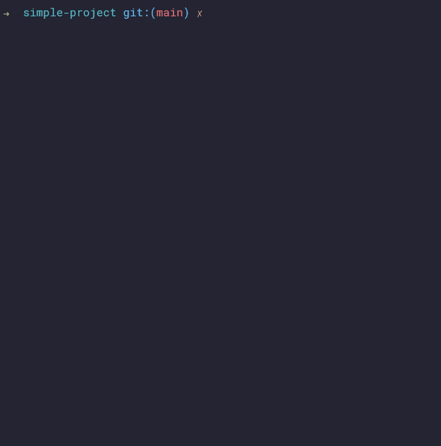

<h1 align="center">doxhell</h1>
<div align="center">

[](https://github.com/sisalik/doxhell/actions/workflows/ci.yml)
[](https://github.com/sisalik/doxhell/issues)
[](https://github.com/sisalik/doxhell/pulls)
[](/LICENSE)

</div>

## About

doxhell allows you to automate documentation tasks for projects with requirements
specifications and manual tests.



## Getting started

These instructions will get you a copy of the project up and running on your local
machine for development and testing purposes.

### Prerequisites

- Python 3.10
- [Poetry](https://python-poetry.org/)
- [Poe the Poet](https://github.com/nat-n/poethepoet) (optional - used to run
  development tasks)
- [wkhtmltopdf](http://wkhtmltopdf.org/) (optional - used for PDF file rendering)

### Installing

Within the repository directory, install dependencies using poetry:
```
poetry install
```

You can then run doxhell from source, as per the [Usage](#Usage) section below, or build
it to use in another environment:
```bash
poetry build
# Example installation in a different project
cd ../another_project
.venv/Scripts/activate
pip install doxhell/dist/doxhell-0.1.0-py3-none-any.whl
```

## Usage

If you followed the above instructions to build and install a wheel, you can run
doxhell simply using:
```
> doxhell
Usage: doxhell [OPTIONS] COMMAND [ARGS]...

  Automate software V&V documentation work.

Options:
  --help  Show this message and exit.

Commands:
  render  Produce PDF output documents from source files.
  review  Validate requirements and tests; check coverage.
```

If you are working from source, the equivalent command to the above is:
```
poetry run python -m doxhell
```

If you have Poe the Poet installed, you can use a simpler form:
```
poe run
```

Any command line arguments can be appended to either command.

## Configuration
doxhell behaviour can be controlled via command line arguments. You can see the
available options for each command by using the `--help` option.

All available settings can also be specified in a TOML config file. By default,
doxhell attempts to load a *pyproject.toml* file in the working directory. If a valid
config file is not available, only command line arguments are used; otherwise, settings
are loaded from the file, but command line arguments always take precedence.

## Examples
The examples directory contains some project examples that have doxhell-enabled
documentation and unit tests. You can try running doxhell commands against these
projects.
